# 🚀 Generating CSV and ZIP Files from Multiple Sources
### SAP BTP Integration Suite (CPI)

Projeto de laboratório desenvolvido durante meus estudos em **SAP BTP – Integration Suite (Cloud Integration)**.

O objetivo deste projeto é demonstrar como construir um **iFlow capaz de consumir dados de múltiplas fontes, converter os dados em CSV e gerar um arquivo ZIP contendo múltiplos arquivos**.

Esse tipo de cenário é comum em **integrações empresariais**, quando precisamos consolidar dados provenientes de diferentes sistemas e gerar arquivos para parceiros externos ou sistemas legados.


---

# 🧩 Integration Scenario

A integração utiliza **duas fontes de dados diferentes**:

1️⃣ Payload enviado via **Postman (XML)**  
2️⃣ Dados consumidos de uma **API OData pública**

API utilizada:


https://services.odata.org/V4/TripPinServiceRW/Airports


Essa API retorna **informações sobre aeroportos**.

---

# 🏗 iFlow Architecture

O fluxo foi desenvolvido utilizando **SAP Integration Suite – Cloud Integration (CPI)**.

Fluxo da integração:


Esses componentes são muito utilizados em projetos reais de integração.


O arquivo **ZIP é enviado automaticamente para um servidor SFTP**.

---

# 🔧 Technologies Used

Nesse laboratório utilizei alguns componentes importantes do **SAP Integration Suite (CPI)**:

- HTTPS Sender Adapter
- Content Modifier
- Request Reply
- OData API
- Parallel Multicast
- XML to CSV Converter
- Join
- Gather (ZIP Aggregation)
- SFTP Receiver

Esses componentes são **muito utilizados em projetos reais de integração**.

---

# 📥 Example Payload (Postman)

Exemplo do payload enviado via Postman:

```xml
<Airports>
   <Airport>
      <IataCode>LHR</IataCode>
      <IcaoCode>EGLL</IcaoCode>
      <Name>London Heathrow Airport</Name>
      <City>London</City>
      <Country>United Kingdom</Country>
   </Airport>
</Airports>
```

📤 Resultado gerado pela integração

A integração gera dois arquivos CSV e os compacta automaticamente em um arquivo ZIP.
```
Airport.zip
 ├── Airport1.csv  (dados do Postman)
 └── Airport2.csv  (dados da API TripPin)
```
Esses arquivos são enviados automaticamente para um servidor SFTP.

🎯 Conceitos praticados

Durante esse laboratório foi possível praticar conceitos importantes de integração:

✔ Consumo de API OData

✔ Manipulação de payloads

✔ Uso de Exchange Properties

✔ Processamento paralelo com Multicast

✔ Conversão XML → CSV

✔ Geração de arquivos ZIP

✔ Integração com SFTP


<br><br><br>
📊 Exemplo Prático do Fluxo

### Criando nosso Iflow


<br><br><br>


### Criando nosso Artifacts

```
Generating CSV and ZIP Files from Multiple Sources
```
<br><br><br>
### Adicionando o HTTPS


<br><br><br>
### Criando nosso Endpoint

```
/generating/csv
```
<br><br><br>
### Adicionar o Content Modifier


<br><br><br>
### Renomeando o Content Modifier

```
originalPayload
```

<br><br><br>
### Capturando a mensagem no Property no Content Modifier

```
Content Modifier originalPayload
Exchange Property
Name: _originalPayload
Type: Expression
Value: ${body}
Data Type: java.lang.String
```

<br><br><br>
### Adicionando um novo Receiver


<br><br><br>
### Renomeando o Receiver

```
ODATAv4
```

<br><br><br>
### Adicionando o Request Replay


<br><br><br>
### Selecionando o oData


<br><br><br>
### Selecionando o oData V4


<br><br><br>
### Renomeando o Receiver

```
Address: https://services.odata.org/V4/(S(okozo2a42m22jenurt2qhucs))/TripPinServiceRW
```

<br><br><br>
### Configurando o oDATA


<br><br><br>
### Configurando o System e Endereço

```
Address: https://services.odata.org/V4/(S(okozo2a42m22jenurt2qhucs))/TripPinServiceRW
```

<br><br><br>
### Selecionando a Entidade do Airports


<br><br><br>
### Selecionando todos os campos e definindo nossa operação


<br><br><br>
### Resultado das configurações do oData em Processing


<br><br><br>
### Convertendo de XML para CSV


<br><br><br>
### Renomenado o XML para CSV

```
XML To CSV Converter
```

<br><br><br>
### Configurando o XML para CSV

```
/Airports/Airport
```

<br><br><br>
### Adicionando o Multicast Parallel


<br><br><br>
### Renomeando Parallel Multicast

```
Parallel Multicast  
```
<br><br><br>
### Adicionando o Content Modifier


<br><br><br>
### Renomeando Content Modifier

```
Airports CSV1 
```
<br><br><br>
### Configurando Property no Content Modifier

```
Content Modifier -  Airports CSV 1 
Exchange Property
Create - __filename - Contant - AirportsCSV1.csv
```

<br><br><br>
### Configurando Body no Content Modifier

```
Content Modifier -  Airports CSV1 
Message Body
Type: Expression
Body: ${property._originalPayload}
```

<br><br><br>
### Adicionando o Content Modifier
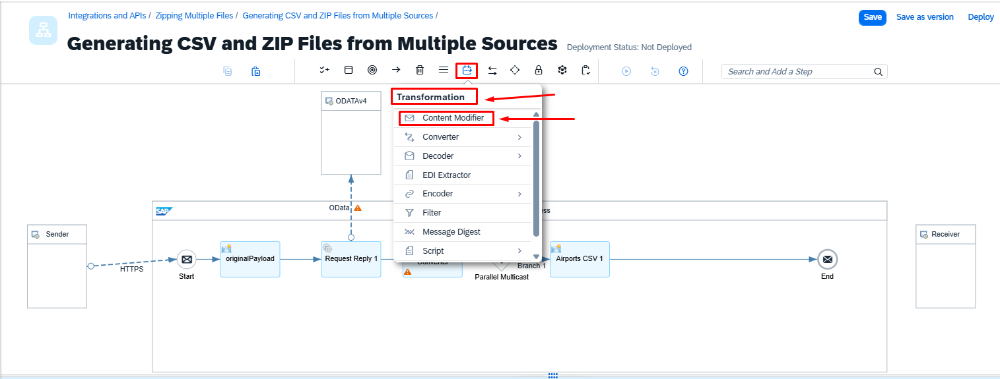

<br><br><br>
### Renomeando Content Modifier
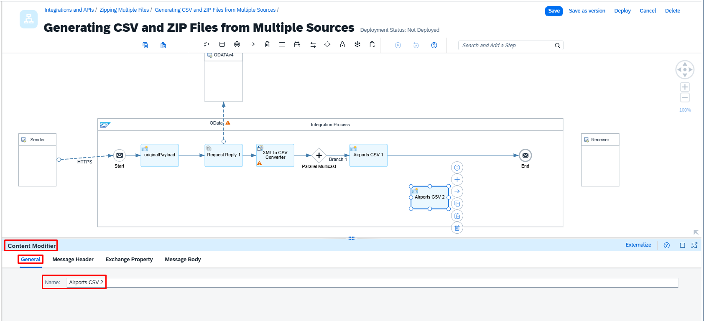
```
Airports CSV2 
```
<br><br><br>
### Configurando Property no Content Modifier
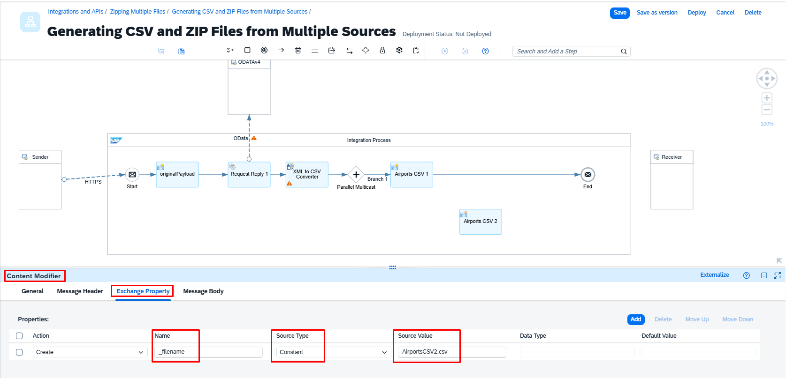
```
Content Modifier -  Airports CSV 2
Exchange Property
Create - __filename - Contant - AirportsCSV2.csv
```
<br><br><br>
### Conectando o Parallel no Content Modifier  na Branch2
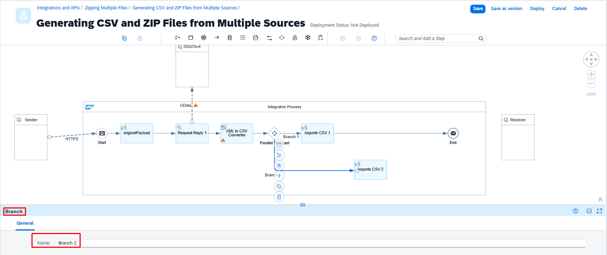
```
Airports CSV2 
```
<br><br><br>
### Copia XML to CSV Converter
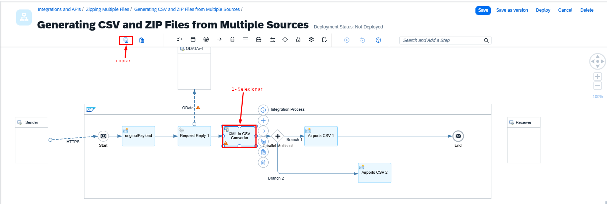


<br><br><br>
### Colado o XML to CSV Converter e Renomeando
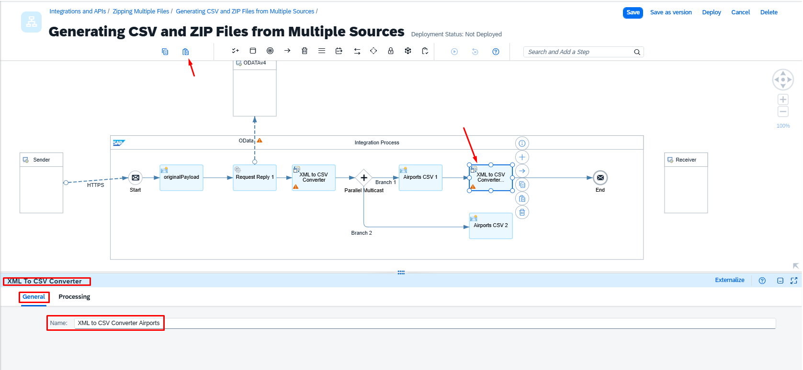
```
XML To CSV Converter Airports
```

<br><br><br>
### Verificando as configurações o XML to CSV Converter 
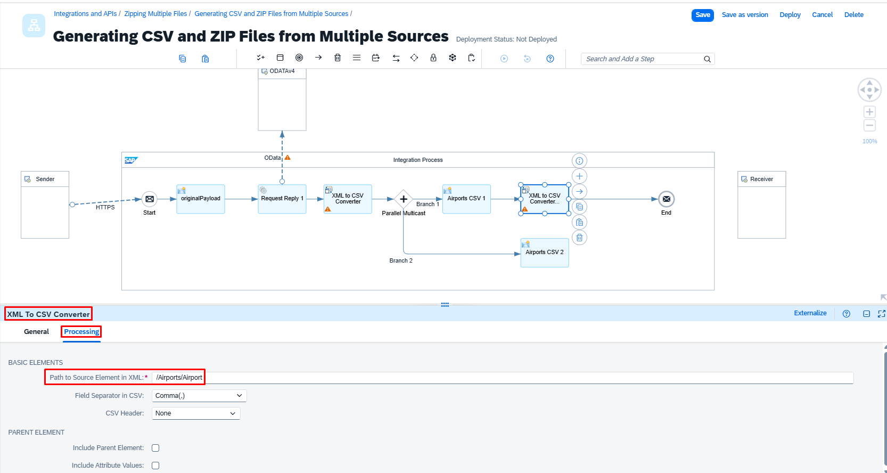
```
/Airports/Airport
```
<br><br><br>
### Adicionando o Join 
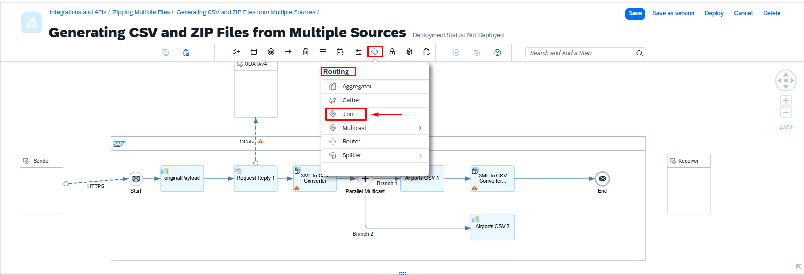

<br><br><br>
### Adicionando o Gather 
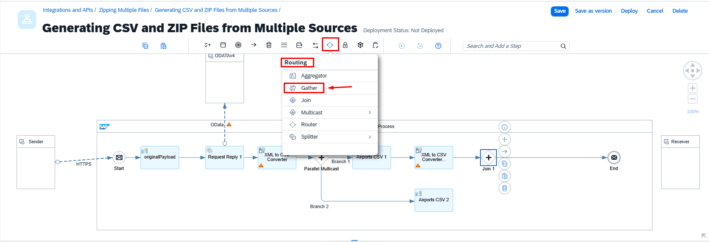

<br><br><br>
### Renomeando o  Gather
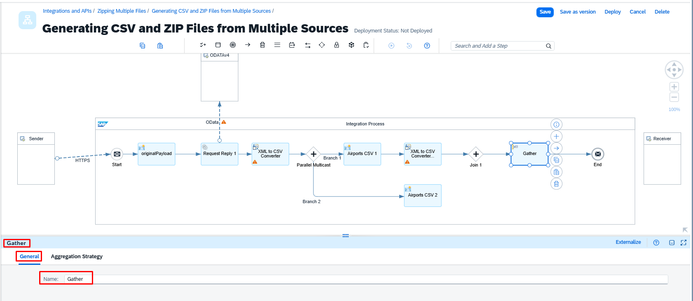
```
Gather
```
<br><br><br>
### Configurando o Gather
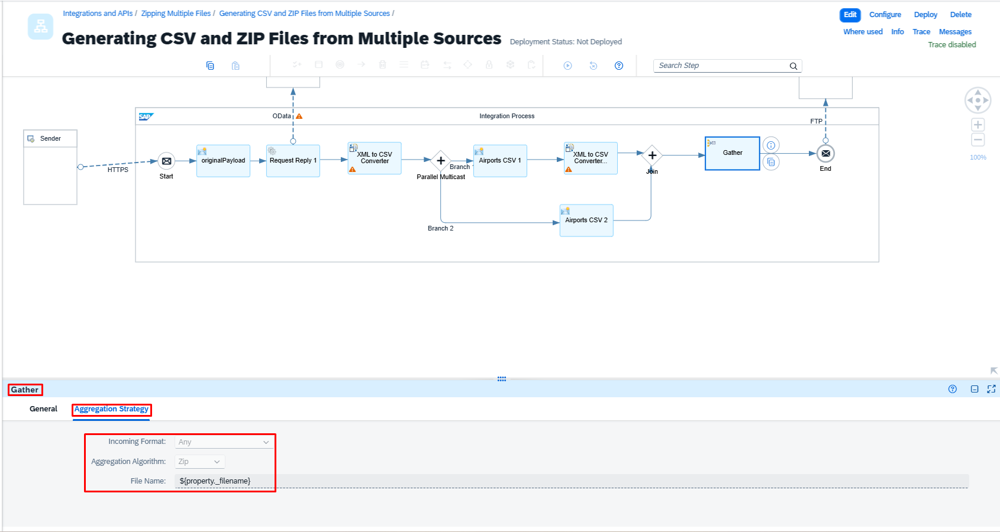
```
Aggregation Strategy
Incoming Format: Any
Aggregation Algorithm: Zip 
File Name: ${property._filename}
```

### Conectando o Content Modifier Airports CSV 2 no Join
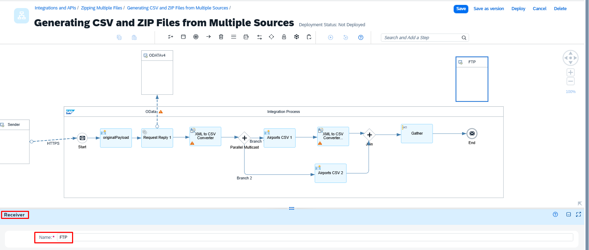

<br><br><br>
### Renomeando o FTP
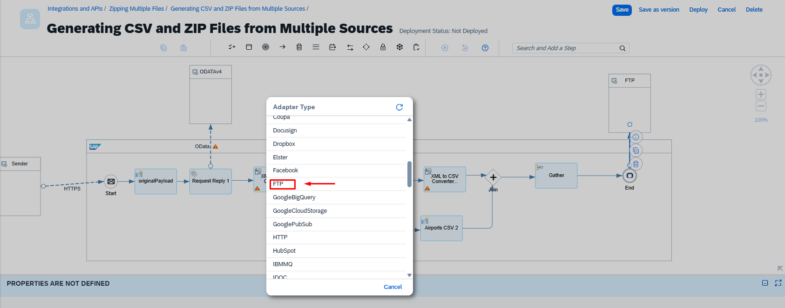
```
FTP
```
<br><br><br>

### Adicionando o FTP
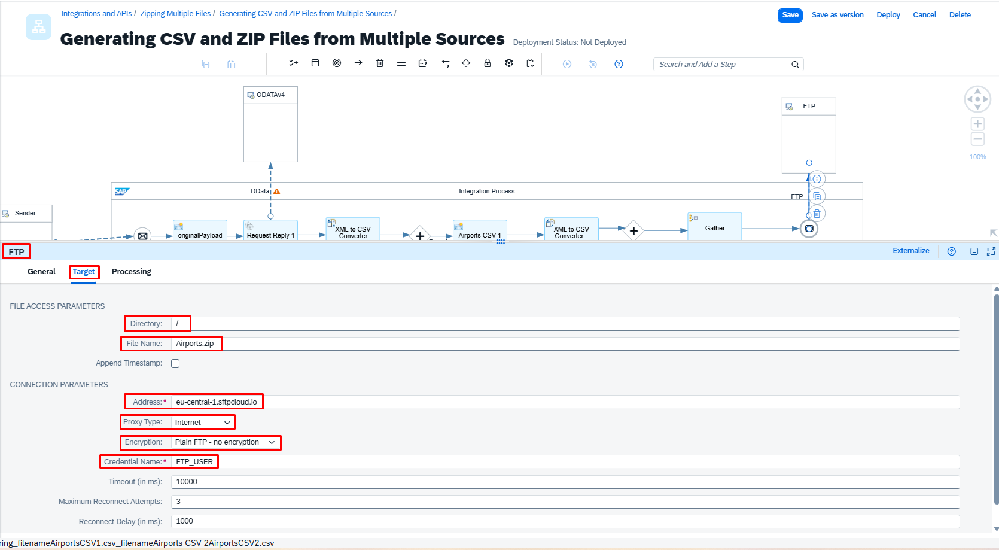

<br><br><br>

### Configurando o FTP na aba Target
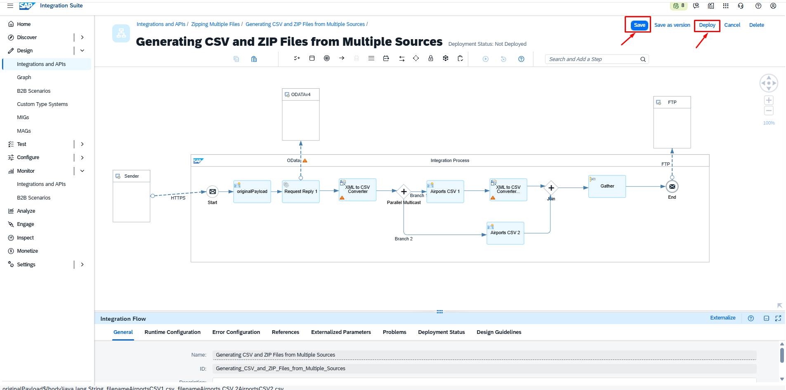
```
End Message - > Receiver
Target
Directory: /
File Neme: Airports.zip
Address: eu-central-1.sftpcloud.io
Proxy Type: Internet
Encryption: Plain FTP - no encryption
Credential Name: FTP_USER
```

<br><br><br>

### Salvar e realizando o Deploy
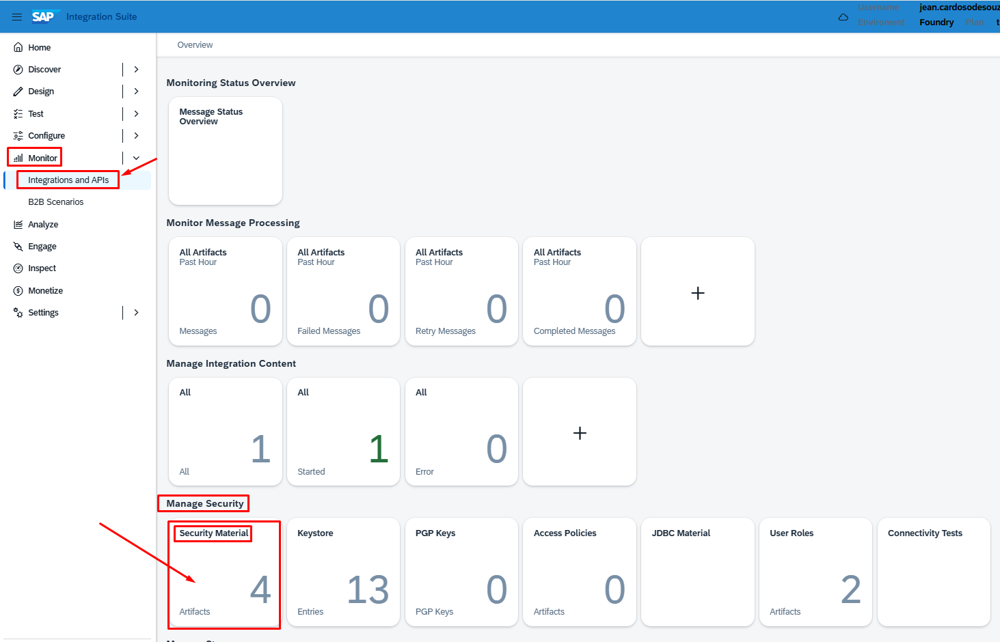

<br><br><br>

### Criando o Security Material
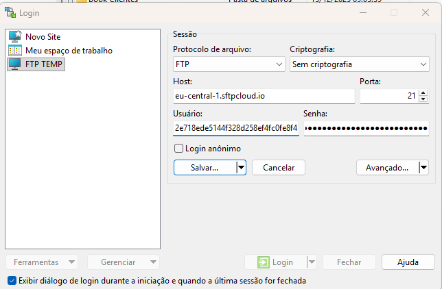

### Configurando o FTP no WINSCP
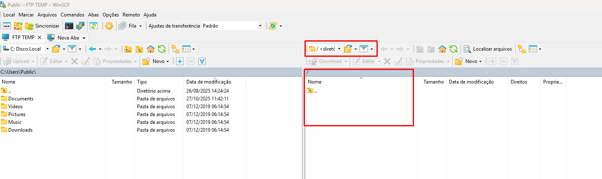

### Acessando o FTP no WINSCP
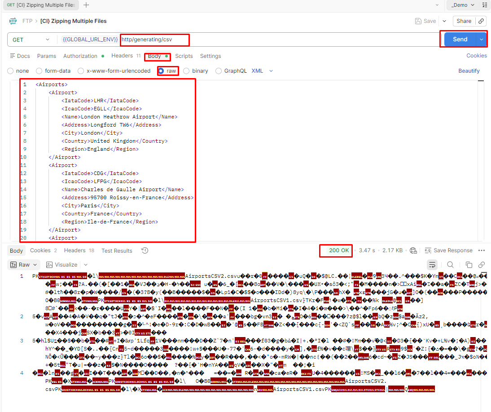

### Configuração do Postman

```
<Airports>
    <Airport>
        <IataCode>LHR</IataCode>
        <IcaoCode>EGLL</IcaoCode>
        <Name>London Heathrow Airport</Name>
        <Address>Longford TW6</Address>
        <City>London</City>
        <Country>United Kingdom</Country>
        <Region>England</Region>
    </Airport>
    <Airport>
        <IataCode>CDG</IataCode>
        <IcaoCode>LFPG</IcaoCode>
        <Name>Charles de Gaulle Airport</Name>
        <Address>95700 Roissy-en-France</Address>
        <City>Paris</City>
        <Country>France</Country>
        <Region>Ile-de-France</Region>
    </Airport>
    <Airport>
        <IataCode>FRA</IataCode>
        <IcaoCode>EDDF</IcaoCode>
        <Name>Frankfurt Airport</Name>
        <Address>60547 Frankfurt</Address>
        <City>Frankfurt</City>
        <Country>Germany</Country>
        <Region>Hesse</Region>
    </Airport>
    <Airport>
        <IataCode>MAD</IataCode>
        <IcaoCode>LEMD</IcaoCode>
        <Name>Adolfo Suárez Madrid–Barajas Airport</Name>
        <Address>Av de la Hispanidad</Address>
        <City>Madrid</City>
        <Country>Spain</Country>
        <Region>Madrid</Region>
    </Airport>
    <Airport>
        <IataCode>BCN</IataCode>
        <IcaoCode>LEBL</IcaoCode>
        <Name>Barcelona–El Prat Airport</Name>
        <Address>08820 El Prat de Llobregat</Address>
        <City>Barcelona</City>
        <Country>Spain</Country>
        <Region>Catalonia</Region>
    </Airport>
    <Airport>
        <IataCode>AMS</IataCode>
        <IcaoCode>EHAM</IcaoCode>
        <Name>Amsterdam Schiphol Airport</Name>
        <Address>Evert van de Beekstraat 202</Address>
        <City>Amsterdam</City>
        <Country>Netherlands</Country>
        <Region>North Holland</Region>
    </Airport>
    <Airport>
        <IataCode>DXB</IataCode>
        <IcaoCode>OMDB</IcaoCode>
        <Name>Dubai International Airport</Name>
        <Address>Dubai Airport Rd</Address>
        <City>Dubai</City>
        <Country>United Arab Emirates</Country>
        <Region>Dubai</Region>
    </Airport>
    <Airport>
        <IataCode>DOH</IataCode>
        <IcaoCode>OTHH</IcaoCode>
        <Name>Hamad International Airport</Name>
        <Address>Hamad Airport Rd</Address>
        <City>Doha</City>
        <Country>Qatar</Country>
        <Region>Doha</Region>
    </Airport>
    <Airport>
        <IataCode>HND</IataCode>
        <IcaoCode>RJTT</IcaoCode>
        <Name>Tokyo Haneda Airport</Name>
        <Address>Hanedakuko Ota City</Address>
        <City>Tokyo</City>
        <Country>Japan</Country>
        <Region>Tokyo</Region>
    </Airport>
    <Airport>
        <IataCode>NRT</IataCode>
        <IcaoCode>RJAA</IcaoCode>
        <Name>Narita International Airport</Name>
        <Address>1-1 Furugome</Address>
        <City>Narita</City>
        <Country>Japan</Country>
        <Region>Chiba</Region>
    </Airport>
    <Airport>
        <IataCode>ICN</IataCode>
        <IcaoCode>RKSI</IcaoCode>
        <Name>Incheon International Airport</Name>
        <Address>272 Gonghang-ro</Address>
        <City>Incheon</City>
        <Country>South Korea</Country>
        <Region>Incheon</Region>
    </Airport>
    <Airport>
        <IataCode>BKK</IataCode>
        <IcaoCode>VTBS</IcaoCode>
        <Name>Suvarnabhumi Airport</Name>
        <Address>999 Bang Phli District</Address>
        <City>Bangkok</City>
        <Country>Thailand</Country>
        <Region>Samut Prakan</Region>
    </Airport>
    <Airport>
        <IataCode>KUL</IataCode>
        <IcaoCode>WMKK</IcaoCode>
        <Name>Kuala Lumpur International Airport</Name>
        <Address>64000 Sepang</Address>
        <City>Kuala Lumpur</City>
        <Country>Malaysia</Country>
        <Region>Selangor</Region>
    </Airport>
    <Airport>
        <IataCode>DEL</IataCode>
        <IcaoCode>VIDP</IcaoCode>
        <Name>Indira Gandhi International Airport</Name>
        <Address>New Delhi 110037</Address>
        <City>New Delhi</City>
        <Country>India</Country>
        <Region>Delhi</Region>
    </Airport>
    <Airport>
        <IataCode>BOM</IataCode>
        <IcaoCode>VABB</IcaoCode>
        <Name>Chhatrapati Shivaji Maharaj International Airport</Name>
        <Address>Sahar Rd</Address>
        <City>Mumbai</City>
        <Country>India</Country>
        <Region>Maharashtra</Region>
    </Airport>
    <Airport>
        <IataCode>GRU</IataCode>
        <IcaoCode>SBGR</IcaoCode>
        <Name>São Paulo/Guarulhos International Airport</Name>
        <Address>Rod. Hélio Smidt</Address>
        <City>São Paulo</City>
        <Country>Brazil</Country>
        <Region>São Paulo</Region>
    </Airport>
    <Airport>
        <IataCode>GIG</IataCode>
        <IcaoCode>SBGL</IcaoCode>
        <Name>Rio de Janeiro–Galeão International Airport</Name>
        <Address>Av. Vinte de Janeiro</Address>
        <City>Rio de Janeiro</City>
        <Country>Brazil</Country>
        <Region>Rio de Janeiro</Region>
    </Airport>
    <Airport>
        <IataCode>EZE</IataCode>
        <IcaoCode>SAEZ</IcaoCode>
        <Name>Ministro Pistarini International Airport</Name>
        <Address>Au Ezeiza Cañuelas</Address>
        <City>Buenos Aires</City>
        <Country>Argentina</Country>
        <Region>Buenos Aires</Region>
    </Airport>
    <Airport>
        <IataCode>SCL</IataCode>
        <IcaoCode>SCEL</IcaoCode>
        <Name>Arturo Merino Benítez International Airport</Name>
        <Address>Armando Cortinez</Address>
        <City>Santiago</City>
        <Country>Chile</Country>
        <Region>Santiago Metropolitan</Region>
    </Airport>
    <Airport>
        <IataCode>MEX</IataCode>
        <IcaoCode>MMMX</IcaoCode>
        <Name>Mexico City International Airport</Name>
        <Address>Av. Capitán Carlos León</Address>
        <City>Mexico City</City>
        <Country>Mexico</Country>
        <Region>Mexico City</Region>
    </Airport>
</Airports>
```

<br><br><br>
### Atualizando o FTP no WINCSP
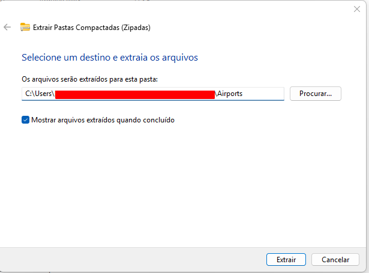


<br><br><br>

📂 Código e documentação

O projeto completo está disponível no GitHub:

(GitHub link aqui)
🔗 Conecte-se comigo


SAP BTP

SAP Integration Suite

APIs e integrações

Sempre aberto para trocar conhecimento com a comunidade SAP.
